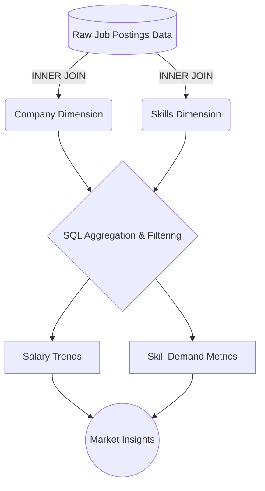

<div align="center">
  <h1>📊 Navigating the Data Science Job Market: Salary & Skills Analysis</h1>
  <h3>An in-depth SQL project analyzing remote opportunities, top-paying skills, and market demand</h3>
  
  <p>
    
    
    
    
  </p>
</div>

## 🌍 Introduction

Hello! I'm **Edgardo Martin Caceres**, a Data Analyst with a strong background in statistical modeling, machine learning, and automated data extraction. 

In today's rapidly evolving tech landscape, knowing *how* to code is only half the battle; knowing *what* to learn next is the key to strategic career growth. This project serves as a comprehensive analysis of the Data Science job market. By leveraging SQL to query a large-scale database of job postings, my objective was to uncover the most lucrative remote opportunities, identify the specific technical skills they demand, and map out the optimal learning path for aspiring and established data professionals.

## 🏢 Background

The data science job market is highly competitive but incredibly rewarding for those with the right skill set. To better understand this landscape, I analyzed a relational database containing comprehensive data on job postings, required skills, and company dimensions. 

My analytical focus was driven by five key questions:
1. What are the top-paying data scientist jobs available remotely?
2. What specific skills are required for these top-tier roles?
3. What are the most universally in-demand skills for data scientists?
4. Which individual skills correlate with the highest average salaries?
5. What is the "sweet spot" (high demand + high salary) for skill acquisition?



## 🛠️ Tools I Used

To architect and execute this analysis, I utilized a modern data stack:
* **SQL:** For executing advanced queries, complex table joins (INNER/LEFT), Common Table Expressions (CTEs), and aggregate functions to extract meaningful insights.
* **Database Management:** Used for structured data querying, handling NULL values, and dataset filtering.
* **Data Visualization & Analytics (Conceptually):** Leveraging my experience with tools like Tableau, Power BI, and Python (Pandas/Scikit-learn) to interpret the raw output and translate it into actionable business intelligence.
* **Git & GitHub:** For version control and showcasing my analytical portfolio.

---

## 🔬 The Analysis

Below is the step-by-step SQL analysis, exploring the job market from broad salary overviews down to granular skill optimizations.

### 1. Identifying the Top-Paying Remote Roles
First, I wanted to find the absolute ceiling of the remote data science market. I filtered for non-null salaries and remote locations.

<details>
<summary><b>View SQL Query</b></summary>

```sql
/*
Question: What are the top-paying data scientist jobs?
-Identify the top 10 highest-paying Data Scientist roles that are available remotely.
-Focuses on job postings with specified salaries (remove nulls).
-Why? Highlight the top-paying opportunities for Data Scientists, especially those that can be done remotely, to help job seekers find lucrative positions in the field.
*/

SELECT
    job_id,
    job_title,
    job_location,
    job_schedule_type,
    salary_year_avg,
    job_posted_date,
    name AS company_name
FROM
    job_postings_fact
LEFT JOIN company_dim ON job_postings_fact.company_id = company_dim.company_id

WHERE
    job_title_short = 'Data Scientist' AND 
    job_location = 'Anywhere' AND
    salary_year_avg IS NOT NULL

ORDER BY
    salary_year_avg DESC

LIMIT 10;
```
</details>

### 2. Deconstructing the Skills Behind the Salaries
Next, I used a CTE (Common Table Expression) to take those exact top 10 jobs and join them with the skills dimension table to see what these companies are asking for.

<details>
<summary><b>View SQL Query</b></summary>

```sql
/*
Question: What skills are required for the top-paying data scientist jobs?
- Use the top 10 highest-paying Data Scientist roles from the first query
- Add the specific skills required for these roles
- Why? It provides a detailed look at which high-paying jobs demand certain skills,
helping job seekers understand what skills they need to develop to qualify for these lucrative positions.
*/

WITH top_paying_jobs AS (

    SELECT
        job_id,
        job_title,
        salary_year_avg,
        name AS company_name
    FROM
        job_postings_fact
    LEFT JOIN company_dim ON job_postings_fact.company_id = company_dim.company_id

    WHERE
        job_title_short = 'Data Scientist' AND 
        job_location = 'Anywhere' AND
        salary_year_avg IS NOT NULL

    ORDER BY
        salary_year_avg DESC

    LIMIT 10
)

SELECT 
    top_paying_jobs.*,
    skills

FROM top_paying_jobs

INNER JOIN skills_job_dim ON top_paying_jobs.job_id = skills_job_dim.job_id
INNER JOIN skills_dim ON skills_job_dim.skill_id = skills_dim.skill_id

ORDER BY
    salary_year_avg DESC
```
</details>

### 3. Market Demand Analysis
Leaving salary aside for a moment, what are the most fundamental skills requested across *all* data scientist postings that don't explicitly require a degree?

<details>
<summary><b>View SQL Query</b></summary>

```sql
/*
Question: What are the most in-demand skills for data scientists?
- Join job postings to inner join table similar to query 2
- Identify the top 5 in-demand skills for a data scientist role and filter for postings that do not require a degree.
- Focus on all job postings.
- Why? Retrieves the top 5 skills with the highest demand in the job market,
    helping job seekers prioritize which skills to develop for better career opportunities.
*/

SELECT 
    skills,
    COUNT(skills_job_dim.job_id) AS demand_count

FROM job_postings_fact

INNER JOIN skills_job_dim ON job_postings_fact.job_id = skills_job_dim.job_id
INNER JOIN skills_dim ON skills_job_dim.skill_id = skills_dim.skill_id

WHERE
    job_title_short = 'Data Scientist' AND 
    job_no_degree_mention IS TRUE

GROUP BY
    skills

ORDER BY
    demand_count DESC

LIMIT 5;
```
</details>

### 4. Top Skills Based on Salary
Here, I aggregated the average salary associated with every individual skill in the dataset to find the highest-paying niche technologies.

<details>
<summary><b>View SQL Query</b></summary>

```sql
/*
Answer: What are the top skills based on salary?
- Look at the average salary associated with each skill for Data Scientist positions.
- Focuses on roles with specified salaries, regardless of location.
- Why? It reveals how different skills impact salary levels for Data Scientists and 
    helps job seekers understand which skills may lead to higher-paying opportunities.
*/

SELECT 
    skills,
    ROUND(AVG(salary_year_avg), 0) AS average_salary

FROM job_postings_fact

INNER JOIN skills_job_dim ON job_postings_fact.job_id = skills_job_dim.job_id
INNER JOIN skills_dim ON skills_job_dim.skill_id = skills_dim.skill_id

WHERE
    job_title_short = 'Data Scientist' AND
    salary_year_avg IS NOT NULL

GROUP BY
    skills

ORDER BY
    average_salary DESC

LIMIT 20;
```
</details>

#### 📊 Visualizing the Financial Impact of Skills
Based on the results of Query 4, I've visualized the top premium skills. Notice the dominance of leadership/management tools and highly specialized engineering tech.

| Skill | Category | Average Salary | Salary Scale (Relative) |
|---|---|---|---|
| **Asana** | Project/Leadership | **$215,477** | ▇▇▇▇▇▇▇▇▇▇ |
| **Airtable** | Data Ops | **$201,143** | ▇▇▇▇▇▇▇▇▇░ |
| **RedHat** | Infrastructure | **$189,500** | ▇▇▇▇▇▇▇▇░░ |
| **Watson** | AI/ML Framework | **$187,417** | ▇▇▇▇▇▇▇▇░░ |
| **Elixir** | Concurrency/Backend | **$170,824** | ▇▇▇▇▇▇▇░░░ |
| **Lua** | Scripting/Game Dev | **$170,500** | ▇▇▇▇▇▇▇░░░ |


### 5. Finding the Optimal Skills to Learn
Finally, I combined demand and salary into a single query to find the "optimal" skills—those that are requested frequently (demand > 10) but also command high average salaries.

<details>
<summary><b>View SQL Query</b></summary>

```sql
/*
Answer: What are the most optimal skills to learn?
- Identify skills in high demand and associated with high average salaries for Data Scientist roles.
- Why? Target skills that offer job security (high demand) and financial benefits (high salaries),
    helping job seekers prioritize their learning and career development efforts.
*/

WITH skills_demand AS (

    SELECT 
        skills_dim.skill_id,
        skills_dim.skills,
        COUNT(skills_job_dim.job_id) AS demand_count

    FROM job_postings_fact

    INNER JOIN skills_job_dim ON job_postings_fact.job_id = skills_job_dim.job_id
    INNER JOIN skills_dim ON skills_job_dim.skill_id = skills_dim.skill_id

    WHERE
        job_title_short = 'Data Scientist' AND
        salary_year_avg IS NOT NULL

    GROUP BY
        skills_dim.skill_id
)

, average_salary AS (

    SELECT 
        skills_job_dim.skill_id,
        ROUND(AVG(salary_year_avg), 0) AS average_salary

    FROM job_postings_fact

    INNER JOIN skills_job_dim ON job_postings_fact.job_id = skills_job_dim.job_id
    INNER JOIN skills_dim ON skills_job_dim.skill_id = skills_dim.skill_id

    WHERE
        job_title_short = 'Data Scientist' AND
        salary_year_avg IS NOT NULL

    GROUP BY
        skills_job_dim.skill_id
)

SELECT
    skills_demand.skill_id,
    skills_demand.skills,
    demand_count,
    average_salary

FROM skills_demand

INNER JOIN average_salary ON skills_demand.skill_id = average_salary.skill_id

WHERE
    demand_count > 10 

ORDER BY
    average_salary DESC,
    demand_count DESC
    
LIMIT 20;
```
</details>

---

## 🧠 What I Learned

Diving into this dataset provided invaluable insights into the realities of the data science job market. Here are the key takeaways from the data:

1. **The Big Two Are Non-Negotiable:** Out of all the skills listed for premium remote roles, **SQL** and **Python** are universally foundational. They are the prerequisite languages for getting a seat at the table.
2. **Big Data & Backend Tech Push the Ceiling:** At the highest salary tiers ($375k - $550k), companies expect more than just model building. Skills like **Java, Spark, Hadoop, and Cassandra** appeared frequently, indicating that top-tier Data Scientists must be capable of handling massive backend deployment and data engineering tasks.
3. **Leadership & Data Ops Pay Premiums:** Surprisingly, the absolute highest average salaries were attached to skills like **Asana** ($215k) and **Airtable** ($201k). This shows that at the senior level, cross-functional project management and team leadership are valued just as heavily as raw coding ability.
4. **Niche Tools Command Niche Salaries:** Deep expertise in specific machine learning ecosystems (like **Hugging Face, Watson, PyTorch**) or containerization platforms (**Kubernetes**) is a direct path to the upper echelon of compensation.

## 🎯 Conclusions

This project solidified my understanding of how technical skills translate into market value. While foundational knowledge in SQL, Python, and visualization tools (like Tableau and Power BI) is essential for entering the field, achieving top-tier compensation requires bridging the gap between data analysis and data engineering. 

To maximize career trajectory as a Data Professional, the optimal strategy is to build a robust foundation in data wrangling and statistical modeling, and then aggressively specialize in cloud infrastructure (AWS/Azure), deep learning frameworks, or team operational leadership.

---
*If you are a recruiter or hiring manager, I'd love to connect and discuss how my blend of statistical analysis, predictive modeling, and SQL expertise can bring value to your data team.*
